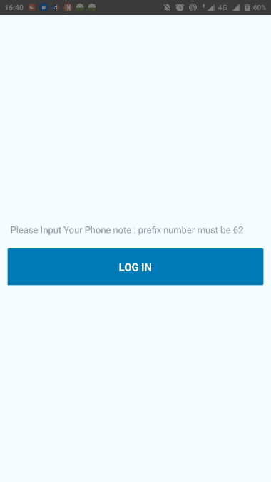

## How To Use (Android)
- git clone https://github.com/detatsatrio/otp-authentication-nexmo-api-for-react-native.git otp-react-native
- cd otp-react-native
- npm install
- input your api_key & api_secret at file App.js
- install your device, if already installed. Run 'adb devices' to check your device.
- react-native run-android 